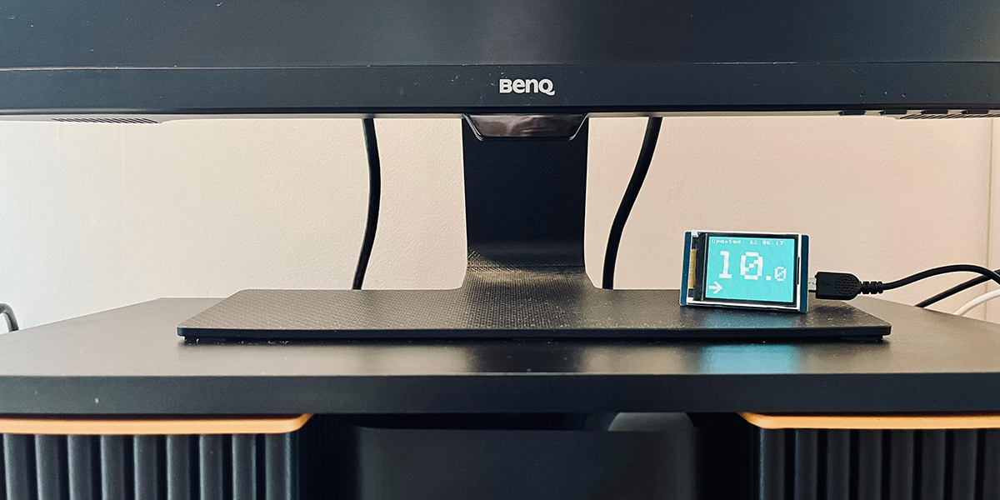

# glucose-viewer-pico

Micropython project to view Freestyle Libre 2 glucose readings in realtime on a Raspberry Pico



This is a small project which will display glucose readings at "real-time" (reading are updated every minute or so) on a Raspberry Pi Pico W. The layout shows the glucose value, the time stamp of the reading and the trend arrow. The project includes the drivers for the display used, which is linked below, but could be configured to work with some other display. To adapt to another display, the number font is custom and scalable and the utils to draw them along with the trend arrows is found in the graphics folder.

## Hardware
The code is set up to run on the following hardware:

- [Raspberry Pico W](https://thepihut.com/products/raspberry-pi-pico-w?variant=41952994787523)
- [Waveshare 1.8"LCD](https://www.waveshare.com/pico-lcd-1.8.htm)

## LibreView API

The project uses the LibreView API to fetch glucose readings. In order to fetch the data from the server, an account has to be set up to configure LibreLinkUp.
Once the account is set up and the app is up and running, you can access the API using your login credentials and a token.

The credentials should be stored in a file called `cofig.py` as follows:

```python
CONFIG = {
    'WIFI_PASSWORD' : "PASSWORD",
    'WIFI_SSID' : "WIFI_NAME",
    'API_TOKEN':"TOKEN",
    'API_USER':"USER_EMAIL",
    'API_PASSWORD':"PASSWORD",
}
```
An example file is provided, just rename it to `config.py` and update with your information.

More info about using the API and generating a token can be found at this unofficial documenation page:
[LibreView Unofficial Docs](https://libreview-unofficial.stoplight.io/)

## License
This code is distributed under the MIT License.
